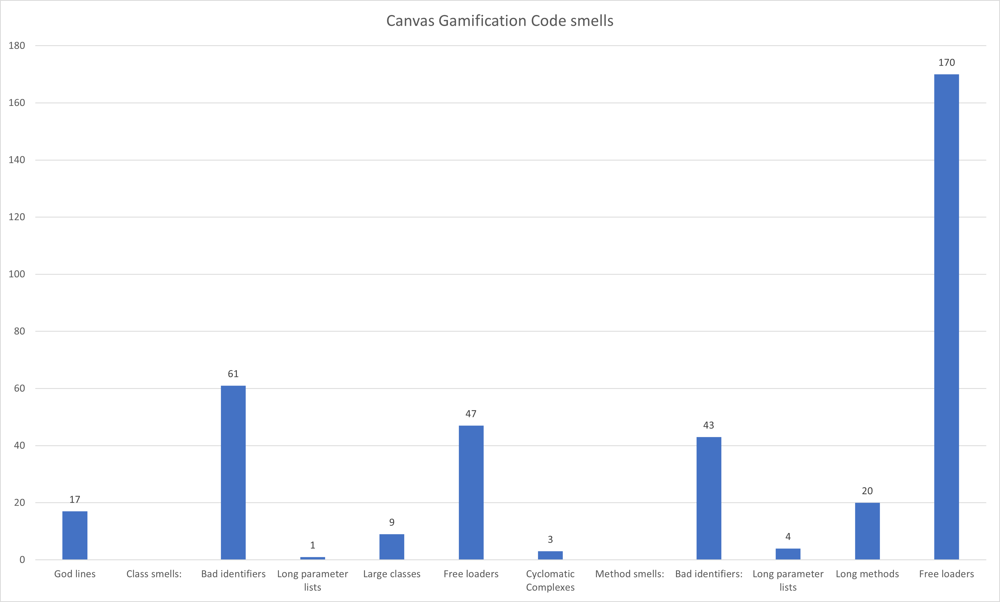

# COSC329Project

### Code Smells

##### Description

This application automatically detects code smells in Python code and reports them.

The specific class level smells this application can detect are:
- Bad identifier (class name length less than 3 or greater than 20 characters)
- Long parameter list (class parameters have more than 3 items)
- Large class (class body longer than 75 lines, excluding blank lines)
- Free loader (class body less than 5 lines, excluding blank lines)
- Cyclomatic complex (class body contains more than 15 loops and branches)

And method level smells:
- God line ( line greater than 200 characters in length)
- Bad identifier (method name length less than 3 or greater than 25 characters)
- Long parameter list (method parameters have more than 5 items)
- Long method (method body longer than 25 lines, excluding blank lines)
- Free loader (method body less than 3 lines, excluding blank lines)

Note that this application assumes the Python code has no syntax errors, uses 4 space soft indents, and does not detect code smells for subclasses

##### Runtime and Environment

- Java (jdk-17.0.1)
- Eclipse (2021-12)

##### Development Steps

- Research code smells
- Determine code smells to detect
- Write code to detect smells
- Test and debug
- Report results

##### How to Run Application

1. Clone repo to local machine
1. Import project to Eclipse
1. Copy raw Python code that you wish to detect smells into the "raw" folder
1. Run the application by clicking the run button in Eclipse
1. The application will generate a "code smells report.txt" file in the root folder

##### Interpreting the Results

"code smells report.txt" will look something like this

```
...
raw\canvas-gamification-master\course\migrations\0001_initial.py
God lines: 60, 135, 147, 158, 171, 185, 208
Classes:
	11 Migration
		Large class
...

Methods:
	40 full_name
		Free loader

	44 average_success_per_difficulty
		Bad identifier
...

Totals:
God lines: 17
Class smells:
	Bad identifiers: 61
	Long parameter lists: 1
	Large classes: 9
	Free loaders: 47
	Cyclomatic Complexes: 3
Method smells:
	Bad identifiers: 43
	Long parameter lists: 4
	Long methods: 20
	Free loaders: 170
```


The report will list all the Python files relative paths to the root folder and their smells first
If a file has god line smells, if will list out all the god line line numbers
Then under its classes section it will start with the line number the classes starts at and then their name, followed by their smells indented
Similarly its methods section will list out method line numbers and method names and their smells
If a class or method has no smells, "No smells" will be displayed

Moving on to the totals section at the end of the report, it basically lists out the counts of each smell

##### Code Breakdown

- class CodeSmells: container of all the methods
- method main(): main line logic, creates the writer to write the report and calls other functions in logical order
- method getPythonFiles(): walks through the "raw" folder and searches for files that end with a ".py" extension, returns a List<File> of all Python files within the "raw" folder
- method readPython(File): takes 1 File parameter, reads the contents of the given File, and returns a Map<Integer, String> with each line's line number as the map's keys and each line as its value
- method String findGodLines(Map<Integer, String>): takes the map of line numbers and line from readPython(File), iterates through the map to determine if any line is a god line and the returns the data in a pretty formatted string to write to output
- method getClassBlocks(Map<Integer, String): takes the map of line numbers and line from readPython(File), iterates through the map and finds all class starting and ending line numbers putting them in a array [start, end] and adding the arrays to a List<int[], then returns the List<int[]>
- method getClassSmells(Map<Integer, String>, int, int):  takes the map of line numbers and line from readPython(File) and the start and end line number indices of a class from getClassBlocks(Map<>), iterates through the map from the start to end of the class and determines if any class level smells exist, returns a pretty formatted string to write to output
- method getMethodBlocks(Map<Integer, String): takes the map of line numbers and line from readPython(File), iterates through the map and finds all method starting and ending line numbers putting them in a array [start, end] and adding the arrays to a List<int[], then returns the List<int[]>
- method getMethodSmells(Map<Integer, String>, int, int):  takes the map of line numbers and line from readPython(File) and the start and end line number indices of a method from getMethodBlocks(Map<>), iterates through the map from the start to end of the method and determines if any method level smells exist, returns a pretty formatted string to write to output
- method countTotals(): counts the total number of each smell, and returns a pretty formatted string to write to output

##### Tests

- Tested with data from the [canvas-gamification](https://github.com/canvas-gamification/canvas-gamification) repo
- Tests for each method done through development, testing and debugging data is print to System.out

##### Bugs/buggy code

- There seems to be a change in some of the counts of smells when I last tested before submission, it was really consistent before and consistent when I last checked too, I think it might be because I grabbed a newer version of the testing repo and some code changed, but not sure

##### Results and Findings

This application was ran on on the [canvas-gamification](https://github.com/canvas-gamification/canvas-gamification) project and here is what was found:



There seems to be a lot of bad identifiers and free loader, but since The canvas gamification project is built on django which is a model-template-view framework, I am sure a part of the code smells are auto generated, it would be better to refer to each file's classes and methods smells in the detailed "code smells report.txt" report

Other than that, the programmers could also check on their god lines, large classes and long methods, since there are quite a few of them as well, everything else seems okay.
